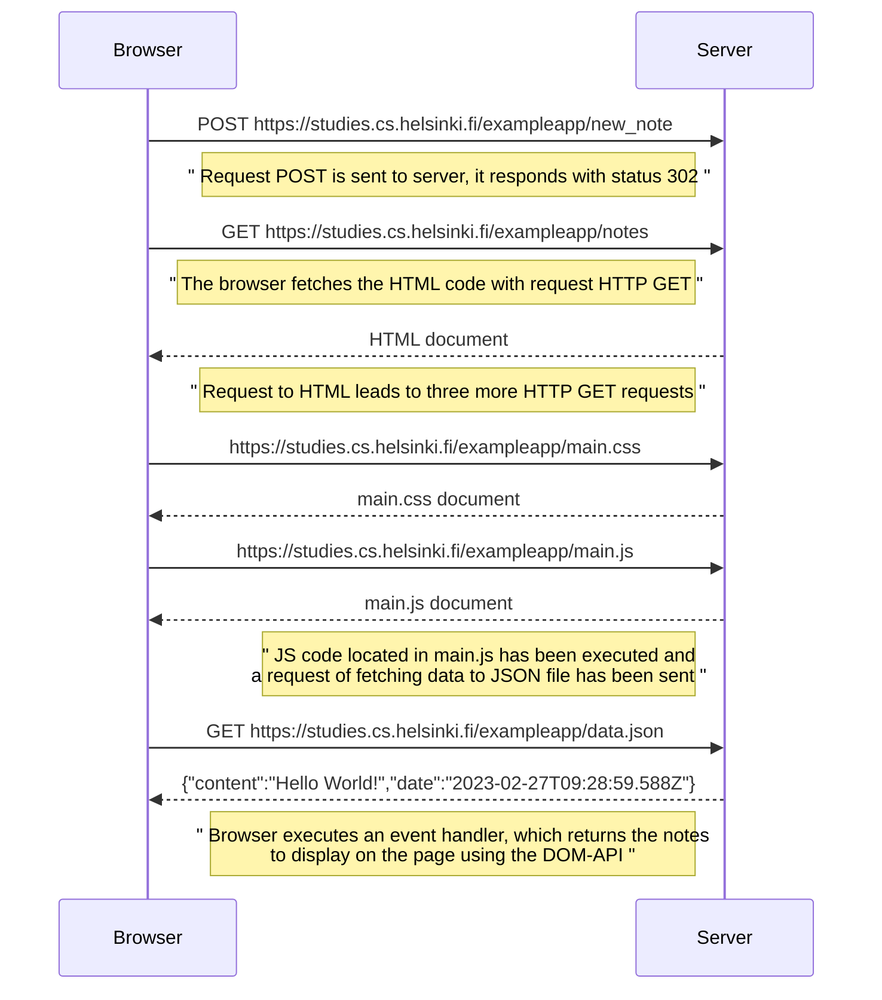

```mermaid
sequenceDiagram
    Browser->>Server: POST https://studies.cs.helsinki.fi/exampleapp/new_note
   note left of Server:" Request POST is sent to server, it responds with status 302  "
   Browser->>Server: GET https://studies.cs.helsinki.fi/exampleapp/notes
note left of Server: " The browser  fetches the HTML code with request HTTP GET "
Server-->>Browser: HTML document
note left of Server: " Request to HTML leads to three more HTTP GET requests "
Browser->>Server: https://studies.cs.helsinki.fi/exampleapp/main.css
Server-->>Browser: main.css document
Browser->>Server: https://studies.cs.helsinki.fi/exampleapp/main.js
Server-->>Browser: main.js document
note left of Server: " JS code located in main.js has been executed and <br> a request of fetching data to JSON file has been sent "
Browser->>Server: GET https://studies.cs.helsinki.fi/exampleapp/data.json
 Server-->>Browser : {"content":"Hello World!","date":"2023-02-27T09:28:59.588Z"}
 note left of Server: " Browser executes an event handler, which returns the notes <br> to display on the page using the DOM-API "
```
