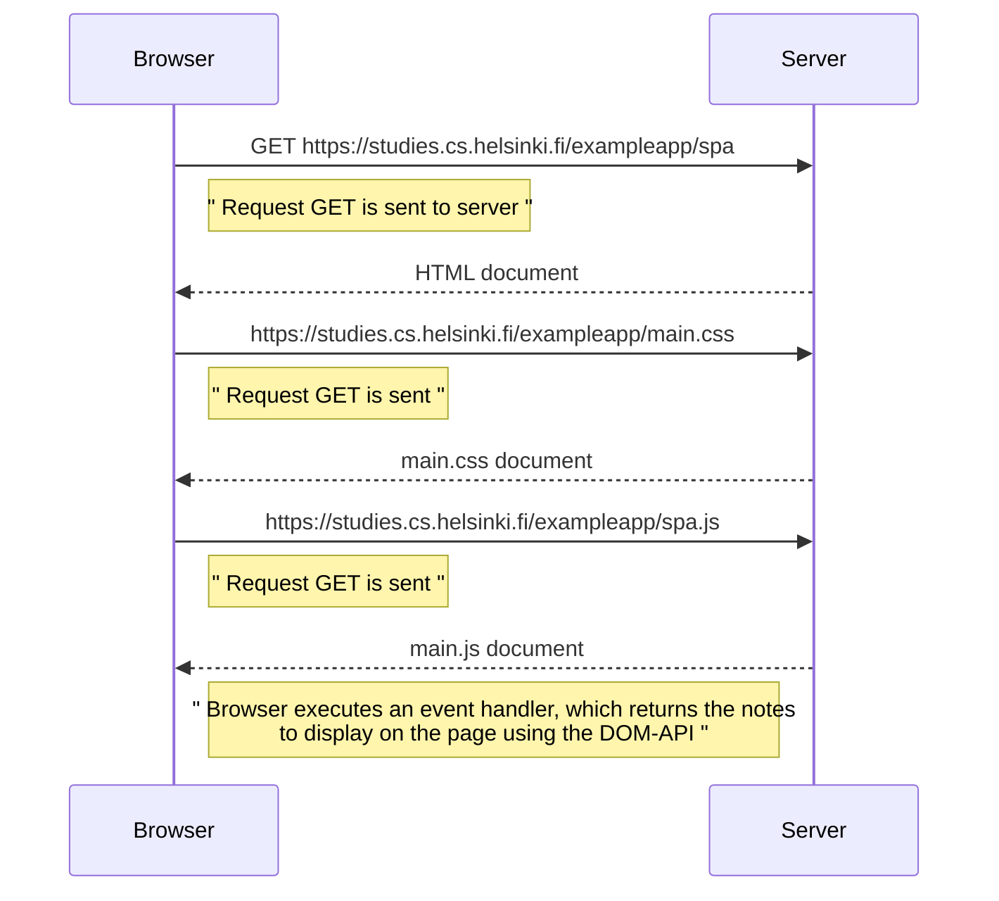

```mermaid
sequenceDiagram
Browser->>Server: GET https://studies.cs.helsinki.fi/exampleapp/spa
note right of Browser:" Request GET is sent to server "
Server-->>Browser: HTML document
Browser->>Server: https://studies.cs.helsinki.fi/exampleapp/main.css
note right of Browser:" Request GET is sent "
Server-->>Browser: main.css document
Browser->>Server: https://studies.cs.helsinki.fi/exampleapp/spa.js
note right of Browser:" Request GET is sent "
Server-->>Browser: main.js document
note left of Server: " Browser executes an event handler, which returns the notes <br> to display on the page using the DOM-API "
```
